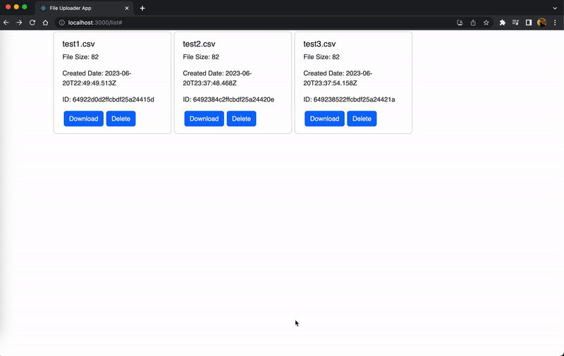
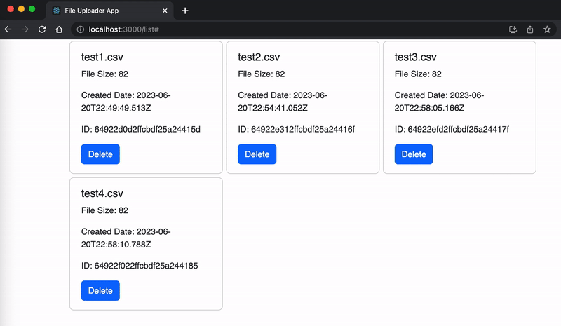
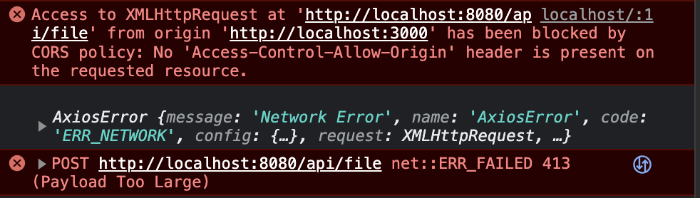
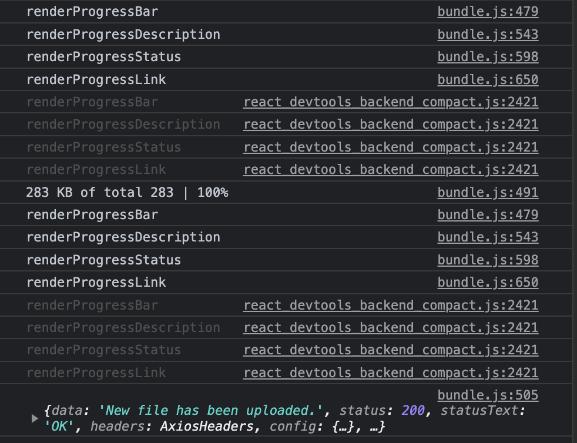

# File Uploader

It is a REACT component for user to upload a data file in tabular format (.csv).

## Assumptions

1. The schema is structured dynamically. Assumed that columns x{n} with n < 30000, and row number varies with 10 < r < 1000.
2. A file size is expected minimum 1GB and up to 5GB.
3. Database is default with NoSQL (MongoDB).
4. The component must have a progress bar and estimated time for completion while uploading data. When upload completes, a completion icon is displayed.
5. Before uploading a data file, checking file format is necessary. If the format does not match the criteria of schema, a warning message is shown. An instruction guides user to re-upload a new file in a suitable format.

<br/>

## UI Design

The UI diagram is designed with Figma (<a href="https://www.figma.com/file/IcajmHdGfN3JzWs2aJtb2l/Genenet-Technology---Upload-Component?type=design&node-id=0%3A1&t=ixck4betCCE0uHJh-1">Link</a>).

<figure>

<figcaption>Fig. 1 - UI Diagram of File Uploader </figcaption>
</figure>

The outcome

<figure>

<figcaption>Fig. 2 - Upload a CSV File </figcaption>
</figure>

<br/>
<br/>

## Introduction to Functions

1. ### Upload Phase (Home Page)

   Drag-and-drop or choose a file to upoload. The component can disaply file name and also check the file extension confined to '.csv'. If no file is selected, upload function (button) will not be invoked. Instead, an error message will show up.
   <figure>
      
      <figcaption>Fig - Home Page</figcaption>
   </figure>
   <figure>
        
        <figcaption>Fig.  - Choose A File </figcaption>
    </figure>
    <figure>
        
        <figcaption>Fig.  - Drag and Drop A File </figcaption>
    </figure>
    <figure>
        
        <figcaption>Fig.  - No File Selected </figcaption>
    </figure>
    <figure>
        
        <figcaption>Fig.  - File Extension Error </figcaption>
    </figure>

2. ### Analysis Phase

   2-1. Analysing
   <figure>
       
       <figcaption>Fig.  - Analysing A File </figcaption>
   </figure>

   2-2. Analysed (deprecated)

3. ### Upload Phase

   3-1. Uploading

   ...

   3-2. Uploaded
    <figure>
       
       <figcaption>Fig.  - A File Uploaded  </figcaption>
   </figure>

4. ### Create a csv file in random size

   User can choose to create a csv file with header (default). If 'with header' is choosed, the header counts one row in the total number of rows.
   <figure>
        
        <figcaption>Fig - Create a CSV file</figcaption>
    </figure>

5. ### Review files info & Donload a csv file from cloud database (MongoDB)

   URL: "http://localhost:3000/list"

   This component provides review funtion and list all data records which are currently stored in database.

   Button "Download" is available to download the data in tabular format from database to local server.

   <figure>
        
        <figcaption>Fig - Download a file</figcaption>
    </figure>

   Button "Delete" is available to remove the data from database (MongoDB).

    <figure>
        
        <figcaption>Fig - Delete a file</figcaption>
    </figure>

<br/>

## Unsolved Issues

1.  **[CSS]**
    Unable to show ":focus" style to "Choose a file" as keyboard navigation (Tab)

2.  **[CSV]**

    When creating a csv file by using Javascripot, composing a content string exceeds the compacity of the runtime system.
    <figure>
    
    <figcaption>Fig.  - String Error</figcaption>
    </figure>

    Possible solutions:

    2-1. (Browser/client side) Using Javascript to execute a command in cmd and create a csv file locally (no recommed because of cyber security issue!)

    2-2. (Server side) Using Node.js to execute file system to execute a command and create a csv file. The client side needs to invoke a server to execute a command and return the outcome to the client.

    2-3. Using Python. This method needs developers to package programming codes as an application for non-programming user.

3.  **[MongoDB]**

    MongoDB Atlas provides a free plan for creating a cluster (database) up to 512 MB. According to assumption, the size of upload file is between 1 GB to 5 GB.

    Possible solutions:

    3-1. If data will not be selected or searched based on content, the upload file can be converted into binary file. The binary file can be chunked and stored discretely in different clusters (database). These storing clusters will be handled by a higher level of cluster to manage the file info and storage info.

    ```
    |----- Cluster Manage (512 MB) : file info, file storage info
    |----- Cluster 1 (512 MB) : Chunked file 1
    |----- Cluster 2 (512 MB) : Chunked file 2
    |----- Cluster 3 (512 MB) : Chunked file 3
    |----- ...
    ```

    3-2. If data is needed to be selected or searched based on content, the dataset can be grouped by columns and be stored discretely in different clusters (database). A cluster can reference another cluster to create a relation. The bonding of reference can simulate the behaviour of relational database.

    ```
    |----- Cluster Manage : file info, file columns info
    |----- Cluster 1 : file data (column A, column B, column C, ...), ref (Cluster 2)
    |----- Cluster 2 : file data (column x, column y, column z, ...), ref (Cluster 3)
    |----- ...
    ```

4.  **[MongoDB or Backend Server]**

    For now, it is unclear that the error is caused by MongoDB API or CORS issue (Access-Control-Allow-Origin).
    <figure>
        
        <figcaption>Fig.  - API Error</figcaption>
    </figure>

    MongoDB use BSON (Binary + JSON) format to store data. This format has its limitation that the filesize is up to 16 MB. For other massive-sized data, MongoDB provides GridFS protocal to store data.

5.  **[Estimate Time]**

    In usual, estimate time should be adjusted dynamically based on internet speed (upload, not download) and the file size which is waiting for upload. Unless we indeedly upload a data to server and execute the runtimes, it is not easy to get the internet speed.

    Possible solutions:

    5-1. Upload 10 MB data to MongoDB and calculate the runtimes. Once the upload completes, delete the data immediately.

    (In RDBMS, this behaviour may result in commit/rollback issues. It is unsure that MongoDb has the similar issue or not. )

    5-2. Download a small-sized file from MongoDB (or other WebSite), calculate the runtimes, and get the runtimes multiplied by 10 as upload time.

    In usual, uppload speeds for home internet are often about 1/10th of the speed of your download speed.

6.  ~~**[React Hook]**~~

    ~~Deep hooks resulted in partial component rendered repeatedly.~~
    <figure>
        
        <figcaption>Fig.  - Deep React Hooks Issue</figcaption>
    </figure>
