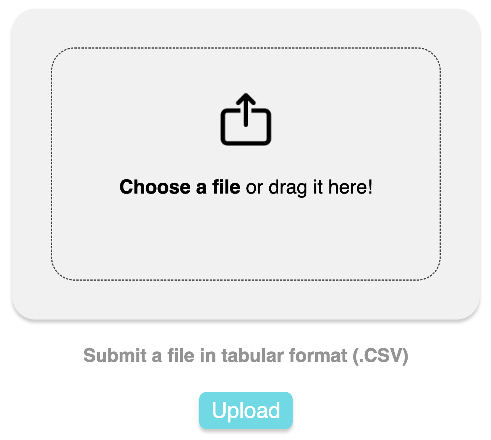
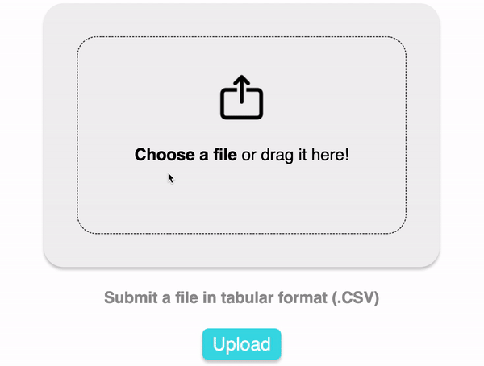
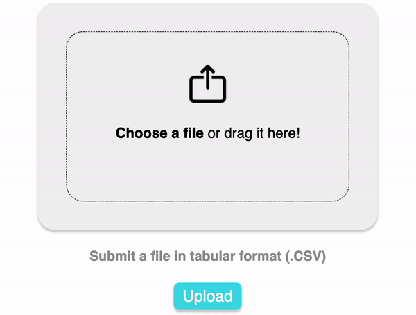
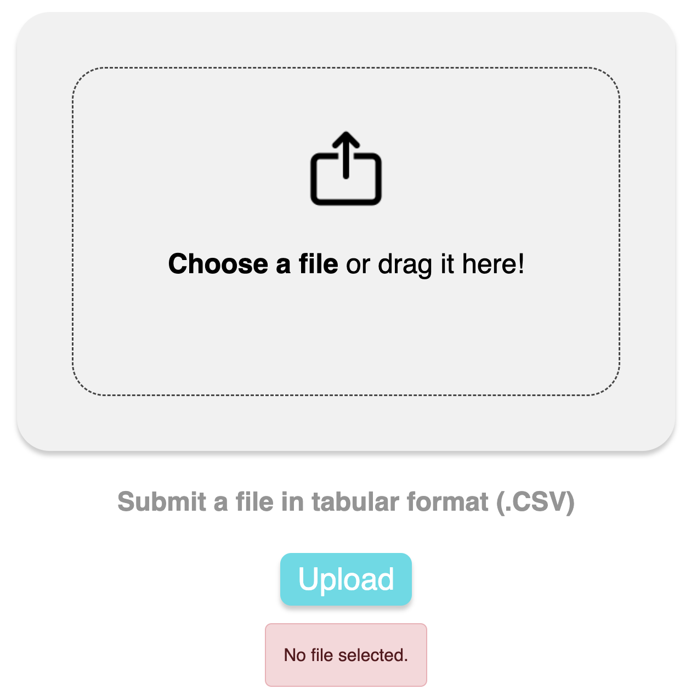
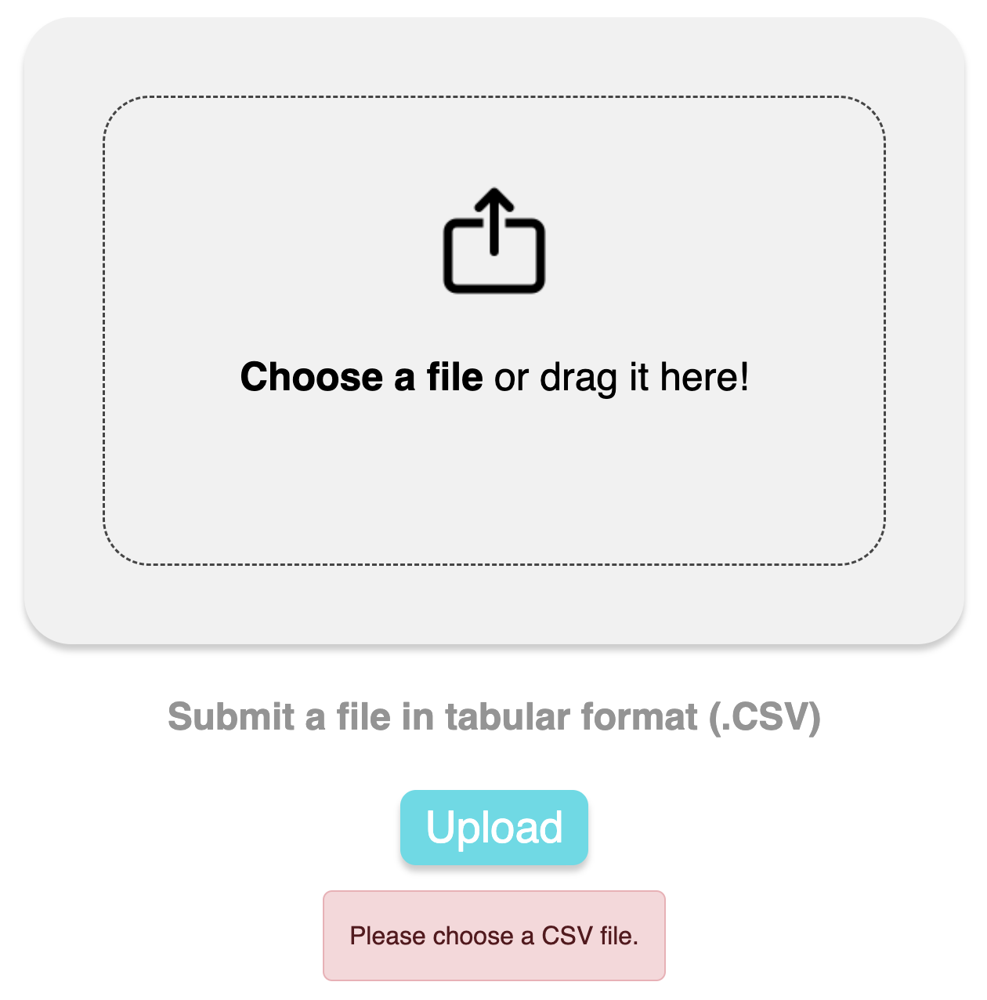
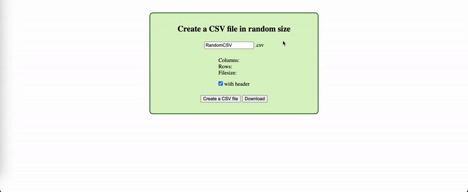
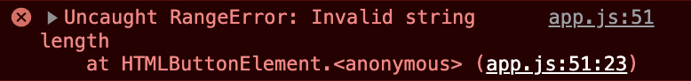

# File Uploader

It is a REACT component for user to upload a data file in tabular format (.csv).

## Assumptions

1. The schema is structured dynamically. Assumed that columns x{n} with n < 30000, and row number varies with 10 < r < 1000.
2. A file size is expected minimum 1GB and up to 5GB.
3. Database is default with NoSQL (MongoDB).
4. The component must have a progress bar and estimated time for completion while uploading data. When upload completes, a completion icon is displayed.
5. Before uploading a data file, checking file format is necessary. If the format does not match the criteria of schema, a warning message is shown. An instruction guides user to re-upload a new file in a suitable format.

 

## UI Design

The UI diagram is designed with Figma (<a href="https://www.figma.com/file/IcajmHdGfN3JzWs2aJtb2l/Genenet-Technology---Upload-Component?type=design&node-id=0%3A1&t=ixck4betCCE0uHJh-1">Link</a>).

<figure>

<figcaption>Fig. 1 - UI Diagram of File Uploader </figcaption>
</figure>

 

## Functrions

1. ### Upload Phase (Home Page)

   Drag-and-drop or choose a file to upoload. The component can disaply file name and also check the file extension confined to '.csv'. If no file is selected, upload function (button) will not be invoked. Instead, an error message will show up.
   <figure>
      
      <figcaption>Fig - Home Page</figcaption>
   </figure>
   <figure>
        
        <figcaption>Fig.  - Choose A File </figcaption>
    </figure>
    <figure>
        
        <figcaption>Fig.  - Drag and Drop A File </figcaption>
    </figure>
    <figure>
        
        <figcaption>Fig.  - No File Selected </figcaption>
    </figure>
    <figure>
        
        <figcaption>Fig.  - File Extension Error </figcaption>
    </figure>

2. ### Analysis Phase

...

#### 2-1. Analysing

...

#### 2-2. Analysed

...

3. ### Upload Phase

...

#### 3-1. Uploading

...

#### 3-2. Uploaded

...

4. ### Create a csv file in random size

   User can choose to create a csv file with header (default). If 'with header' is choosed, the header counts one row in the total number of rows.
   <figure>
        
        <figcaption>Fig - Create a CSV file</figcaption>
    </figure>

5. ### Donload a csv file from cloud database (MongoDB)

...

 

## Unsolved Bugs

1. **[CSS]** Unable to show ":focus" style to "Choose a file" as keyboard navigation (Tab)
2. **[CSV]** When creating a csv file, composing a content string exceeds the compacity of the runtime system.
<figure>

<figcaption>Fig.  - String Error</figcaption>
</figure>
